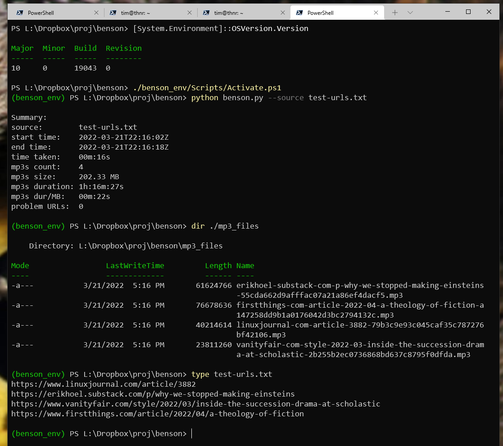

<div id="top"></div>

[](https://opensource.org/licenses/MIT)
[](https://github.com/timoteostewart/benson)

<br />
<div align="center">

  <a href="https://github.com/timoteostewart/benson">
  </a>

<h3 align="center">Benson.py turns URLs into mp3s of the web pages' content &mdash;
<br> <i>take charge of your reading backlog!</i> </h3>


<p align="center" dir="auto">
    <br>
    <br>
    <a href="https://github.com/timoteostewart/benson/issues">Report Bug</a>
    ·
    <a href="https://github.com/timoteostewart/benson/issues">Request Feature</a>
  </p>

</div>


<!-- TABLE OF CONTENTS -->
<details>
  <summary>Table of Contents</summary>
  <ol>
    <li>
      <a href="#about-the-project">About The Project</a>
      <ul>
        <li><a href="#built-with">Built With</a></li>
      </ul>
    </li>
    <li>
      <a href="#getting-started">Getting Started</a>
      <ul>
        <li><a href="#prerequisites">Prerequisites</a></li>
        <li><a href="#installation">Installation and Usage</a></li>
      </ul>
    </li>
    <li><a href="#roadmap">Roadmap and Future Enhancements</a></li>
    <li><a href="#contributing">Contributing</a></li>
    <li><a href="#license">License</a></li>
    <li><a href="#contact">Contact</a></li>
  </ol>
</details>


<!-- ABOUT THE PROJECT -->
## About The Project

Benson accepts a list of URLs via database query or from a filename passed by command line argument
and turns the web pages' content into individual audio files (currently, mp3s for portability).

I love to keep up with the latest articles and blog posts, but who has the time to relax and just catch up on reading anymore?
What finally worked for me was to batch up the URLs of articles and blog posts I wanted to read
and convert them to mp3 files that I listen to at 2x speed while I'm driving the car, walking the dog, or doing the dishes.
Benson is the latest iteration of how I turn my reading backlog into convenient and quickly consumed audio files.

If you find Benson useful to you, by all means clone or fork it and customize to your heart's content.
Pull requests are also welcome if you want to help me improve and expand the project.

As you might've guessed, I picked the name Benson after the sarcastic yet affable butler portrayed by [Robert Guillaume](https://en.wikipedia.org/wiki/Robert_Guillaume) in the 1980s sitcom [*Benson*](https://en.wikipedia.org/wiki/Benson_(TV_series)). It's all part of the fun tradition of naming software after butlers. ([Jenkins](https://www.jenkins.io/), [Alfred](https://www.alfredapp.com/), [Belvedere](https://belvedere.en.softonic.com/), anyone?)

<p align="right">(<a href="#top">back to top</a>)</p>


### Built With

 * [Trafilatura](https://github.com/adbar/trafilatura) by [Adrien Barbaresi](https://github.com/adbar) for content extraction
 * [pyttsx3](https://github.com/nateshmbhat/pyttsx3) by [Natesh Bhat](https://github.com/nateshmbhat) for text-to-speech
 * [ffmpeg-python](https://github.com/kkroening/ffmpeg-python) by [Karl Kroening](https://github.com/kkroening) for mp3 details

 Thanks, y'all!

<p align="right">(<a href="#top">back to top</a>)</p>


<!-- GETTING STARTED -->
## Getting Started

### Prerequisites

* [ffmpeg](https://www.ffmpeg.org/download.html) needs to be in your system path

### Installation and Usage

1. Clone the repo.
   ```sh
   git clone https://github.com/timoteostewart/benson.git
   ```
2. Prepare and activate a venv (the Windows method is shown).
   ```sh
   python -m venv benson_env
   ./benson_env/Scripts/Activate.ps1
   ```
3. Ensure pip requirements are installed.
   ```sh
   pip install -r requirements.txt
   ```
4. Start turning URLs into audio files immediately. (See screenshot below.)
   ```sh
   python benson.py --source test-urls.txt
   ```
5. And of course customize `db.py` and `secrets.yaml` to pull from your database or wherever else you keep your URLs.
<br>
<br>



<p align="right">(<a href="#top">back to top</a>)</p>


<!-- ROADMAP -->
## Roadmap and Future Enhancements

- [ ] If URL is not currently available or scrapable, check for snapshots on archive.is, Wayback Machine, and similar.
- [ ] Implement progress indicator with estimated time of completion (useful for very large lists of URLs)
- [ ] Populate the ID3 fields in the mp3 to the extent possible
- [ ] For domain pronunciations not in domains_pronunciations.txt, try scraping the URL of the article and try to find a human-readable string that resembles the components of the domain. For example, it would be ideal for Benson to visit "https://avanwyk.com/" and determine that "avanwyk.com" could be spoken aloud as "Andrich van Wyk dot com". [Obligatory xkcd](https://xkcd.com/1425/)

<p align="right">(<a href="#top">back to top</a>)</p>


<!-- CONTRIBUTING -->
## Contributing

Contributions are welcome! Even small changes and refactors.
Fork the repo and create a pull request.
You may also open an issue with the tag "enhancement".
Feel free to ⭐ the project too. Thanks!

1. Fork the Project
2. Create your Feature Branch (`git checkout -b feature/AmazingFeature`)
3. Commit your Changes (`git commit -m 'Add some AmazingFeature'`)
4. Push to the Branch (`git push origin feature/AmazingFeature`)
5. Open a Pull Request so I can check it out

<p align="right">(<a href="#top">back to top</a>)</p>


<!-- LICENSE -->
## License

Distributed under the MIT License. See [`LICENSE`](https://github.com/timoteostewart/benson/blob/main/LICENSE) file for more information.

<p align="right">(<a href="#top">back to top</a>)</p>


<!-- CONTACT -->
## Contact

Tim Stewart - tim@texastim.dev

Benson project link: [https://github.com/timoteostewart/benson](https://github.com/timoteostewart/benson)

I'm currently looking for work as a software dev!
Say hello on email or [LinkedIn](https://www.linkedin.com/in/texastimdev/)
and let's talk about how I can help create solutions to the challenges you and your customers are facing.

<p align="right">(<a href="#top">back to top</a>)</p>


<!-- MARKDOWN LINKS & IMAGES -->

[product-screenshot]: ./screenshot.png
